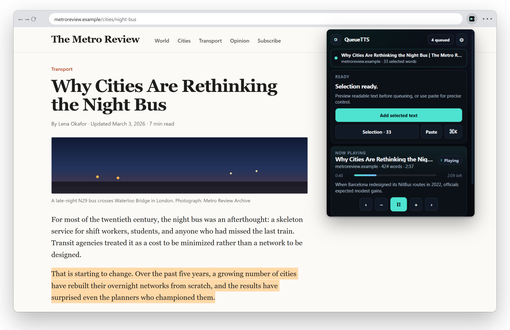
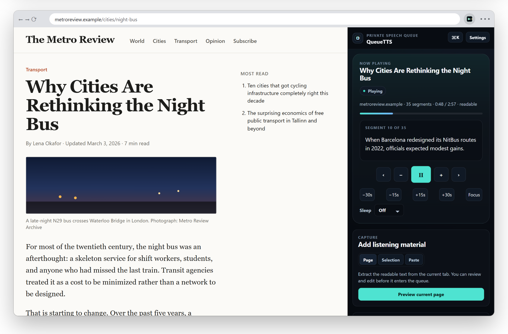

# QueueTTS

Save articles, selections and pasted text to a queue in Chrome, then listen to them later with your computer's text-to-speech voices. No account, no server. The queue lives in your browser's local storage.



## What it does

You find something worth reading but don't have time to read it. Select a paragraph or capture the whole page, and it goes into the queue. When you're ready, press play and QueueTTS reads it aloud sentence by sentence, then moves on to the next item.

Page capture strips navigation, cookie banners, share buttons, newsletter boxes and comment threads before anything is queued. If a page doesn't yield enough readable text (a dashboard, a login wall), the item is flagged so you can paste the text in yourself.



## Install

QueueTTS is not on the Chrome Web Store yet. To run it from source:

1. Download or clone this repository.
2. Open `chrome://extensions` and turn on **Developer mode**.
3. Click **Load unpacked** and choose the repository folder.
4. Pin QueueTTS from the puzzle-piece menu so the icon stays in the toolbar.

It needs Chrome 116 or later. There is no build step and nothing to `npm install`.

## Using it

| To | Do this |
|---|---|
| Queue a selection | Select text, right-click, **Add selected text to QueueTTS**. Or open the popup and press **Add selected text**. |
| Queue a whole page | Right-click the page, **Add current page to QueueTTS**. Or use **Add this page** in the popup. |
| Queue text from anywhere | Open the popup, press **Paste**, paste, then **Add to queue** (or Ctrl+Enter). |
| Play, pause, skip | The popup works as a remote. The side panel shows the full queue and the sentence being read. |
| Change the voice or speed | Settings (gear icon). Rate goes from 0.5× to 3×. |
| Stop after a while | Pick a sleep timer in the side panel. |

### Keyboard

In the side panel:

| Key | Action |
|---|---|
| Space | Play or pause |
| J / K | Next / previous sentence |
| N / P | Next / previous item |
| / | Search the queue |
| F | Focus view |
| Ctrl+K | Command menu |

In the popup, Space plays or pauses, P opens the paste box and Q opens the full queue.

## Privacy

Captured text, the queue and your settings are stored with `chrome.storage.local` on your computer. QueueTTS has no backend, no analytics and no account.

Speech goes through Chrome's text-to-speech API. Voices installed on your operating system (for example *Microsoft Zira* on Windows) run locally. Voices whose names start with **Google** are network voices, so Chrome sends the text being spoken to Google. If that matters to you, pick a local voice in Settings.

The extension reads a page only when you ask it to capture something. It uses `activeTab` rather than access to all sites.

| Permission | Used for |
|---|---|
| `activeTab`, `scripting` | Reading the current page when you capture it |
| `storage` | Saving the queue and settings |
| `tts` | Speaking |
| `contextMenus` | The right-click capture items |
| `sidePanel` | The full queue view |
| `alarms` | The sleep timer |

## Status

QueueTTS is early and has known problems. The most important ones:

- Capturing something new while audio is playing can stop playback.
- Resuming after a pause of more than about 30 seconds can stall, because Chrome suspends the extension's background worker.
- Some sites capture poorly. MDN and GitHub pages currently come back empty, and Wikipedia includes its reference list.
- Short lines without end punctuation are sometimes read with a spoken "Heading." cue. Set **Headings** to *Pause after heading* in Settings to avoid it.
- The light theme is not finished.

The full review, with reproduction steps, screenshots and a fix plan, is in [docs/audit/AUDIT.md](docs/audit/AUDIT.md).

## Development

Plain JavaScript modules, no framework, no dependencies.

```
manifest.json        MV3 manifest
src/background.js    service worker: capture, queue playback, context menus, sleep timer
src/content.js       page and selection extraction, injected only on capture
src/shared.js        storage, text cleanup, sentence splitting, time estimates
src/popup.js         toolbar popup
src/sidepanel.js     full queue view
src/options.js       settings page
pages/, styles/      HTML and CSS for the three surfaces
```

Run the checks (manifest shape, file references, syntax):

```bash
npm run check
```

After editing, reload the extension from `chrome://extensions`.
