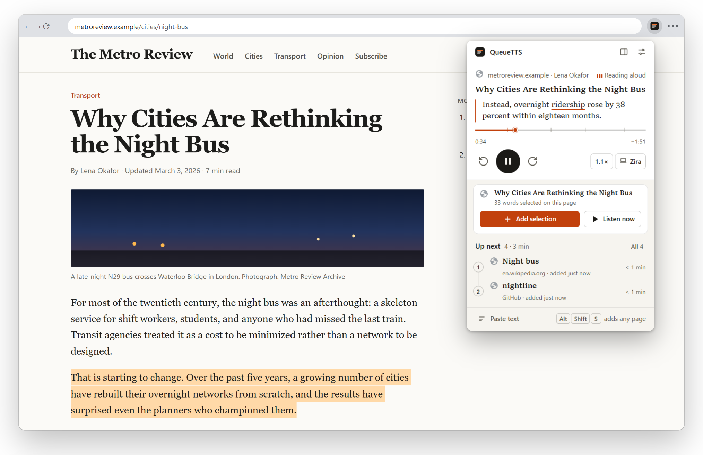
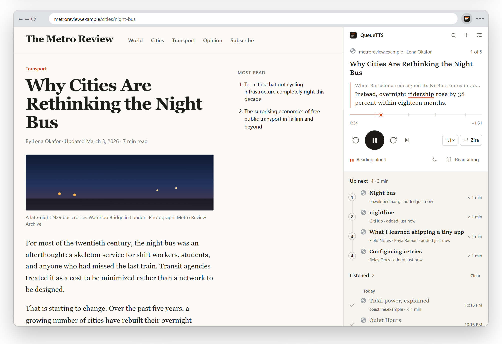
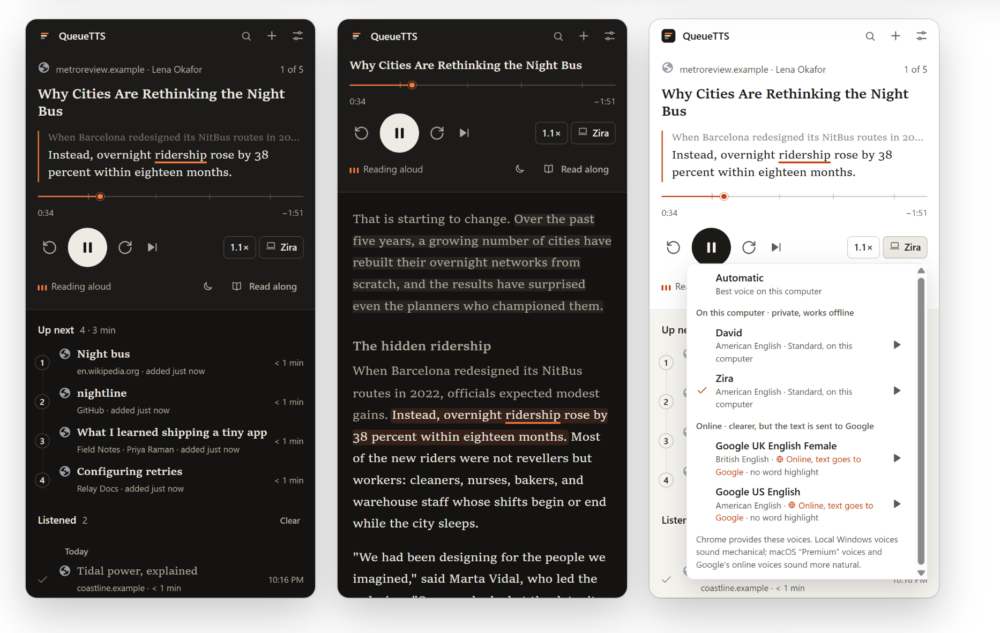
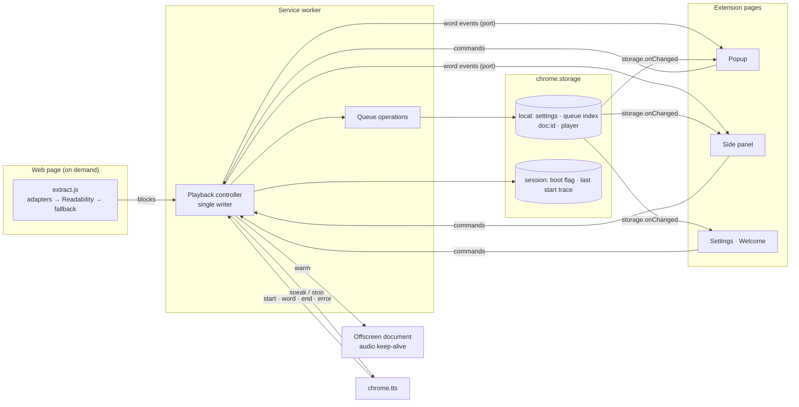
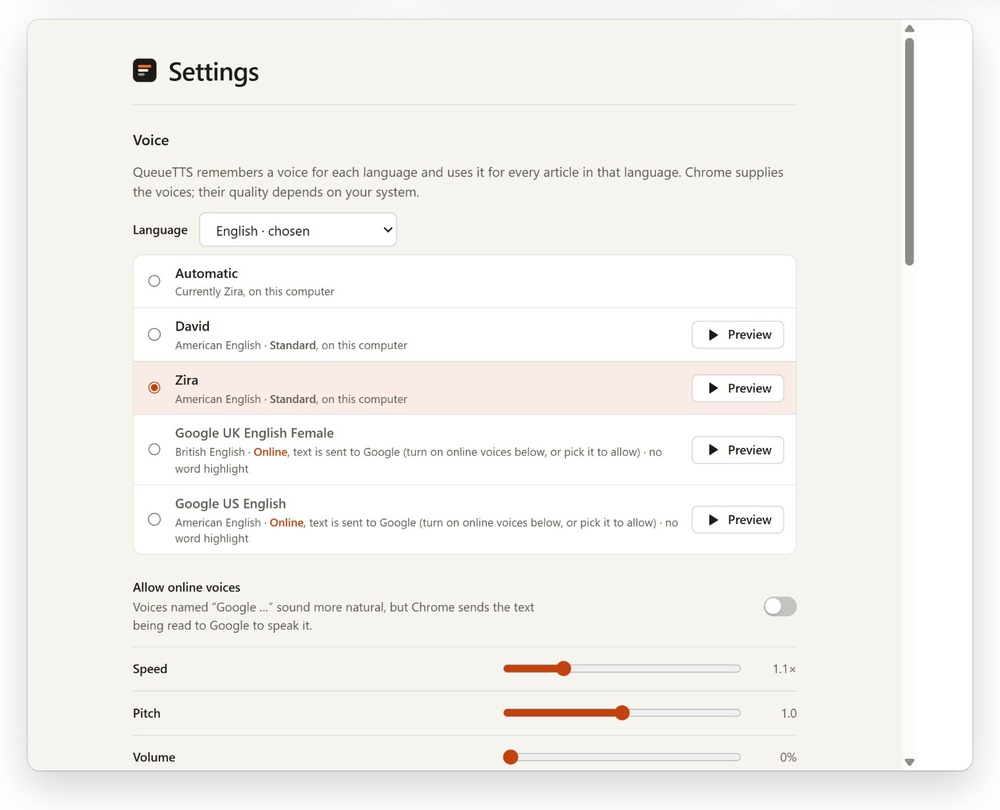

<div align="center">


# QueueTTS

**A private listen-later queue for the web.**

Save articles or selected text as you find them. QueueTTS reads them aloud in order and picks up from the sentence where you stopped, even after you restart Chrome.

  

[Install](#install) · [Privacy](#privacy-and-permissions) · [How it works](#how-it-works) · [Voices](#voices) · [Shortcuts](#keyboard-shortcuts) · [Development](#development)

</div>



## Install

QueueTTS isn't on the Chrome Web Store yet. There's no build step: the folder you clone is the extension.

1. Clone this repository: `git clone https://github.com/Mahan-Imanian/QueueTTS.git`. Don't run `npm install` in it; that's only for development.
2. Open `chrome://extensions` and turn on **Developer mode**.
3. Click **Load unpacked** and choose the cloned folder.
4. A welcome page opens. Press **Hear how it works**, choose a voice, and pin QueueTTS from the puzzle-piece menu.

Chrome loads the whole folder, including `docs/`, `test/` and any `node_modules/`, so a clean clone is the leanest copy.

## What it does

- **Save a page or a selection.** Press <kbd>Alt</kbd>+<kbd>Shift</kbd>+<kbd>S</kbd>, use the toolbar button or right-click. With text selected, only the selection is saved. A small confirmation with *Undo* appears on the page.
- **Reads the article, not the page.** Navigation, cookie banners, share buttons, newsletter boxes, comments, captions, citation markers and hidden text are left out. Wikipedia, GitHub and MDN have dedicated handling; everything else goes through Mozilla Readability, then a fallback.
- **Plays in order.** New items join the end of the queue and never interrupt what you're hearing. When an article ends, it moves to *Listened* and the next one starts.
- **Resumes exactly.** Pause, close Chrome, come back days later: it restarts the sentence you stopped on.
- **Follow along.** The side panel shows the sentence being read, with the current word underlined, and a position bar marked with the article's real section headings. *Read along* shows the whole text; click any sentence to jump there.
- **Picks a voice per language.** It chooses the best voice for each article's language and remembers the one you prefer. Online voices are clearly labelled, because they send text to Google.
- **Stays out of the way.** Keyboard shortcuts, a numbered queue you can reorder by dragging or with <kbd>Alt</kbd>+<kbd>↑</kbd>/<kbd>↓</kbd>, a sleep timer, search, undo for every removal, and export and import of the whole queue.

## Privacy and permissions

Your queue, article text and position live in `chrome.storage.local`, inside your Chrome profile. There is no server, no analytics and no telemetry. QueueTTS has no host permissions and reads a page only when you add it.

**The one thing that can leave your computer:** if you choose a voice named "Google …", Chrome's speech engine (`chrome.tts`) sends the sentence being spoken to Google. These voices are off until you pick one and are labelled as online wherever voices appear.

`npm run check` fails if `fetch`, `XMLHttpRequest`, WebSocket or `sendBeacon` appears in `src/` or `pages/` (vendored Readability excepted), or if the manifest gains host permissions.

| Permission | Why |
|---|---|
| `activeTab` | Access to the tab you're adding, only at the moment you add it |
| `scripting` | Injecting the extractor into that tab to read the article |
| `storage` | Your queue, positions and settings |
| `unlimitedStorage` | Lifting Chrome's 10 MB cap so large queues fit |
| `tts` | Speaking |
| `offscreen` | Keeping the audio output awake while you listen, so the first words aren't cut off |
| `contextMenus` | The right-click items |
| `sidePanel` | The queue beside the page |
| `alarms` | The sleep timer, and resuming if Chrome suspends the extension mid-sentence |
| `favicon` | Site icons from Chrome's own favicon cache; QueueTTS never fetches them |

## How it works



Saved pages are split into headings, paragraphs, lists, quotes and code. Headings get a pause rather than an announcement; code is skipped unless you ask for it.





The service worker is the only writer of queue and playback state. More in [docs/architecture.md](docs/architecture.md); timings in [docs/performance.md](docs/performance.md).

## Voices

QueueTTS speaks through Chrome's `chrome.tts` API, so it uses whatever voices Chrome exposes.

| Kind | Examples | Quality | Privacy |
|---|---|---|---|
| Local, standard | Microsoft David, Mark and Zira on Windows | Mechanical | Text never leaves the computer |
| Local, enhanced | macOS "Premium" and "Enhanced" voices | Natural | Text never leaves the computer |
| Online | Google US English, Google UK English | Clearer and more natural | Chrome sends the text being spoken to Google; no word-by-word highlight |

Voices are ranked by the article's language, then quality: enhanced local, online (only if you've allowed them), standard local. An online voice is never chosen unless you've picked one or switched them on.



## Keyboard shortcuts

These work while Chrome is focused. To use them from other apps, set them to **Global** at `chrome://extensions/shortcuts`, where you can also change the keys.

| Shortcut | Action |
|---|---|
| <kbd>Alt</kbd>+<kbd>Shift</kbd>+<kbd>S</kbd> | Add this page, or the selected text |
| <kbd>Alt</kbd>+<kbd>Shift</kbd>+<kbd>L</kbd> | Play or pause |
| <kbd>Alt</kbd>+<kbd>Shift</kbd>+<kbd>Q</kbd> | Open QueueTTS |
| Not set (assign your own) | Forward one sentence |
| Not set (assign your own) | Back one sentence |

In the popup and side panel: <kbd>Space</kbd> play or pause, <kbd>←</kbd> <kbd>→</kbd> one sentence back or forward, <kbd>N</kbd> next item, <kbd>−</kbd> <kbd>+</kbd> speed, <kbd>R</kbd> read along, <kbd>/</kbd> search, <kbd>?</kbd> list them all.

## Development

Tested on Node 24 and Chrome 142. The end-to-end tests also need at least one local text-to-speech voice, which Windows and macOS include.

```bash
npm install
npm run check      # manifest, file references, syntax, no-network rule
npm test           # 25 unit tests
npm run test:e2e   # 46 tests in your installed Chrome (set CHROME_PATH if needed)
```

After editing, reload QueueTTS in `chrome://extensions`. Extraction fixes need a fixture in `test/fixtures` and a test in `test/e2e/extraction.test.js`.

## Project structure

```
manifest.json   extension manifest
pages/          popup, side panel, settings, welcome and offscreen pages
src/            service worker, extractor, shared logic, UI, vendored Readability
styles/         CSS
assets/         icons and screenshots
scripts/        check and vendor scripts
test/           unit, end-to-end and perf tests, page fixtures
docs/           architecture, performance and limitations notes
```

## Limitations

No on-page highlighting, PDF support or sync between computers yet; English interface only; not yet tested with a screen reader. See [docs/limitations.md](docs/limitations.md) for supported sites, browsers and the roadmap.

## License

No license has been chosen yet, so all rights are reserved for now. The vendored Mozilla Readability is under the Apache License 2.0 (`src/vendor/READABILITY-LICENSE.md`).

<!-- TODO(mahan): choose a license -->
