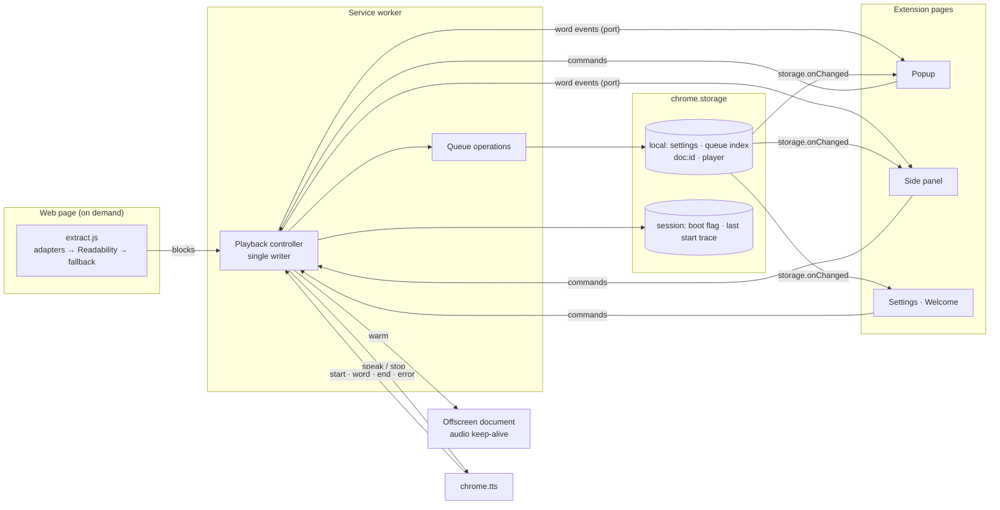

<div align="center">


# QueueTTS

**A private listen-later queue for the web.**

Save articles or selected text as you find them. QueueTTS reads them aloud in order and picks up from the sentence where you stopped, even after you restart Chrome.


[Install](#install) · [How it works](#how-it-works) · [Privacy](#privacy) · [Voices](#voices) · [Architecture](#architecture) · [Development](#development)

</div>


## Why QueueTTS

Chrome and Edge can already read the page you're on. What they can't do is remember a reading list. You find five articles during the day, and then what? Most listen-later services solve this by uploading everything you save to their servers and charging a subscription for the good voices.

QueueTTS keeps the queue in your browser. You add pages from any tab, they wait in order, and when you press play they're read one after another with the voices your computer and Chrome already have. Close the panel, switch tabs, pause for a week: the position is saved per sentence.

## What it does

- **Save a page or a selection.** Press <kbd>Alt</kbd>+<kbd>Shift</kbd>+<kbd>S</kbd>, use the toolbar button or right-click. With text selected, only the selection is saved. A small confirmation with *Undo* appears on the page.
- **Reads the article, not the page.** Navigation, cookie banners, share buttons, newsletter boxes, comments, captions, citation markers and hidden text are left out. Wikipedia, GitHub and MDN have dedicated handling; everything else goes through Mozilla Readability, then a fallback.
- **Plays in order.** New items join the end of the queue and never interrupt what you're hearing. When an article ends, it moves to *Listened* and the next one starts.
- **Resumes exactly.** Pause, close Chrome, come back days later: it restarts the sentence you stopped on.
- **Follow along.** The side panel shows the sentence being read, with the current word underlined, and a position bar marked with the article's real section headings. *Read along* shows the whole text; click any sentence to jump there.
- **Picks a voice per language.** It chooses the best voice for each article's language and remembers the one you prefer. Online voices are clearly labelled, because they send text to Google.
- **Stays out of the way.** Global shortcuts, a numbered queue you can reorder by dragging or with <kbd>Alt</kbd>+<kbd>↑</kbd>/<kbd>↓</kbd>, a sleep timer, search, undo for every removal, and export and import of the whole queue.

## How it works


1. **Save.** On any article, press <kbd>Alt</kbd>+<kbd>Shift</kbd>+<kbd>S</kbd>. QueueTTS extracts the text into headings, paragraphs, lists, quotes and code, and stores it locally.
2. **Listen.** Press play in the popup, the side panel, or with <kbd>Alt</kbd>+<kbd>Shift</kbd>+<kbd>L</kbd> from any tab. Headings get a pause rather than an announcement; code is skipped unless you ask for it.
3. **Come back.** The queue, your position and your listening history survive closing the panel, the tab and the browser.

<table>
<tr>
<td width="33%"><b>Up next, dark theme.</b> The current item sits in the deck; the queue is numbered on a rail, and recently added items say so.</td>
<td width="33%"><b>Read along.</b> The deck compacts and the full text follows the voice, with read sentences dimmed.</td>
<td width="33%"><b>Voice picker.</b> Local and online voices are grouped and labelled, each with a preview.</td>
</tr>
</table>


## Privacy

Privacy here is a property of the code, not a policy page.

| Question | Answer |
|---|---|
| Where is my queue stored? | In `chrome.storage.local`, inside your Chrome profile. The queue index, each article's text and the playback position are separate keys. |
| Does QueueTTS make network requests? | No. There is no server, no analytics and no telemetry. `npm run check` fails if `fetch`, `XMLHttpRequest`, WebSocket or `sendBeacon` appears anywhere outside the vendored Readability file. |
| When does it read a page? | Only when you add it, through the toolbar button, the right-click menu or your shortcut. It uses `activeTab`, so it has no standing access to any site. |
| What leaves my computer? | Nothing, with local voices. If you choose a voice named "Google …", Chrome sends the sentence being spoken to Google to synthesise it. These voices are off until you pick one, and they're labelled wherever voices appear. |
| What about favicons? | They come from Chrome's own favicon cache through the `favicon` permission. QueueTTS never fetches them. |

| Permission | Used for |
|---|---|
| `activeTab`, `scripting` | Reading the page you choose to add |
| `storage`, `unlimitedStorage` | Your queue and settings, without Chrome's 10 MB cap |
| `tts` | Speaking |
| `offscreen` | Keeping the audio output awake while you listen, so the first words aren't cut off (see below) |
| `contextMenus` | The right-click items |
| `sidePanel` | The queue beside the page |
| `alarms` | The sleep timer, and resuming if Chrome suspends the extension mid-sentence |
| `favicon` | Site icons from Chrome's local cache |

## Voices

QueueTTS speaks through Chrome's `chrome.tts` API, so it uses whatever voices Chrome exposes.

| Kind | Examples | Quality | Privacy |
|---|---|---|---|
| Local, standard | Microsoft David, Mark and Zira on Windows | Mechanical | Text never leaves the computer |
| Local, enhanced | macOS "Premium" and "Enhanced" voices | Natural | Text never leaves the computer |
| Online | Google US English, Google UK English | Clearer and more natural | Chrome sends the text being spoken to Google; no word-by-word highlight |

**Defaults.** QueueTTS ranks voices by the article's language first, then by quality: enhanced local voices, then online voices if you've allowed them, then standard local voices. It never chooses an online voice unless you've picked one or switched them on. The first-run page offers both, with previews, and says plainly what each choice means.

**Why there's no premium cloud voice.** Paid providers (ElevenLabs, OpenAI, Azure) sound far better. Using them would mean sending everything you save to a third party under an API key you manage, paying per character, adding host permissions, and losing word timing with some providers. Local neural engines that run in the browser need large model downloads, and the common phonemiser is GPL-licensed. Neither fits a free, private extension today. That decision is revisited in the [roadmap](#roadmap).

**Starting quickly and keeping the first word.** Every start is instrumented, and *Settings → About* shows the last measurement. On a Windows 11 test machine with Chrome 142:

| Situation | Play → speech engine starts | Play → first spoken word |
|---|---|---|
| Local voice, cold (no QueueTTS surface opened yet) | 346 ms | 478 ms |
| Local voice, QueueTTS opened first | 76 ms | 210 ms |
| Local voice, resuming | ~36 ms | ~155 ms |
| Google online voice, cold | 722 ms | — |
| Google online voice, QueueTTS opened first | 398 ms | — |

QueueTTS itself takes 1–10 ms from your click to calling the speech engine. The exception is the very first play, which takes about 110 ms because it also starts the audio keep-alive. The rest is the engine loading a voice, or Google's servers, which is why opening the popup or side panel silently warms the engine. Wireless and Bluetooth headsets switch off their audio link when it's quiet and drop the first fraction of a second when it wakes. QueueTTS keeps the output awake with an inaudible stream from an offscreen document while you're listening, and for up to 90 seconds after you pause.

**How text is prepared for speech.** Sentences are split with `Intl.Segmenter`, with guards for abbreviations and initials ("Dr.", "U.C.L.A.", "J. R. R."). Citation markers, URLs, emoji and markdown symbols are dropped. ISO dates become spoken dates, number ranges are read as "20 to 60", and "e.g.", "vs." and "w/" are expanded. Headings and list items get closing punctuation so the voice ends them like sentences. Things that could change meaning, such as "km/h" and "TCP/IP", are left alone.

## Supported content

| Works well | Declined, with a message |
|---|---|
| News articles and blogs | Pages that are mostly lists of links, such as section fronts |
| Wikipedia, without references, infoboxes or citation markers | Pages with almost no text, such as dashboards and login walls |
| GitHub READMEs, with code kept as code | Chrome's own pages and the Web Store, which extensions can't read |
| MDN reference pages, old and 2025 layouts | PDFs; select the text and use *Paste text* instead |
| Documentation sites, essays, table-layout pages | |
| Any selection, and any pasted text | |

Checked on live pages: Wikipedia, paulgraham.com, MDN, two GitHub READMEs, martinfowler.com and Guardian articles. The test suite covers the same layouts with offline fixtures.

## Keyboard shortcuts

Global, changeable at `chrome://extensions/shortcuts`:

| Shortcut | Action |
|---|---|
| <kbd>Alt</kbd>+<kbd>Shift</kbd>+<kbd>S</kbd> | Add this page, or the selected text |
| <kbd>Alt</kbd>+<kbd>Shift</kbd>+<kbd>L</kbd> | Play or pause |
| <kbd>Alt</kbd>+<kbd>Shift</kbd>+<kbd>Q</kbd> | Open QueueTTS |

In the popup and side panel: <kbd>Space</kbd> play or pause, <kbd>←</kbd> <kbd>→</kbd> one sentence back or forward, <kbd>N</kbd> next item, <kbd>−</kbd> <kbd>+</kbd> speed, <kbd>R</kbd> read along, <kbd>/</kbd> search, <kbd>↑</kbd> <kbd>↓</kbd> <kbd>Enter</kbd> <kbd>Delete</kbd> move, play and remove in the queue, <kbd>Alt</kbd>+<kbd>↑</kbd> <kbd>↓</kbd> reorder, <kbd>?</kbd> list them all. On the position bar, <kbd>PgUp</kbd> and <kbd>PgDn</kbd> jump between sections.

## Install

QueueTTS isn't on the Chrome Web Store yet.

1. Clone or download this repository.
2. Open `chrome://extensions` and turn on **Developer mode**.
3. Click **Load unpacked** and choose the repository folder.
4. A welcome page opens. Press **Hear how it works**, choose a voice, and pin QueueTTS from the puzzle-piece menu.

There's no build step: the folder you clone is the extension.


## Architecture



- **One writer.** The service worker is the only code that changes the queue or playback state. Pages send commands and render from `storage.onChanged`, and the worker serialises every change through one promise chain.
- **Durable playback.** Position is a block and sentence index saved on every sentence start. Pausing stops speech and saves the position. Resuming speaks that sentence again rather than relying on `tts.resume()`, so it works whether the worker has been suspended for seconds or days.
- **Recovering from the browser lifecycle.** At startup the worker checks a flag in `chrome.storage.session`, which survives worker restarts but not browser restarts. After a browser restart, "playing" becomes "paused". After a worker restart mid-sentence, it resumes. A watchdog alarm runs only while playing.
- **Honest state.** The UI says *Playing* only after the engine reports the first spoken word, or its start event for voices without word events. Errors fall back to the automatic voice once, then show a message with *Try again*.
- **Cheap persistence.** A sentence change writes the small `player` key. Article text lives in its own `doc:<id>` key and is written once. Lists update row by row, so playback never re-renders the queue or moves keyboard focus.
- **Extraction** runs only when you add something: `scripting.executeScript` injects the extractor, gets typed blocks back, and leaves no listener behind.

### Project structure

```
manifest.json
src/background/index.js   playback controller, queue, capture, commands, recovery, warm-up
src/content/extract.js    site adapters, Readability, visible-DOM fallback, junk filtering
src/audio/keepalive.js    offscreen document that keeps the audio output awake
src/lib/text.js           sentence segmentation, speech normalisation, reading plan
src/lib/voices.js         voice tiers, ranking, per-language preference
src/lib/queue.js          pure queue operations
src/lib/store.js          storage schema, validation, migration from 2.x
src/ui/deck.js            the player: reading window, section ruler, transport, popovers
src/ui/rows.js            queue and history rows
src/ui/panel.js           side panel workspace and read-along view
src/ui/popup.js           toolbar popup
src/ui/options.js         settings and About
src/ui/welcome.js         first-run page
src/vendor/               Mozilla Readability (Apache License 2.0)
styles/ui.css             design tokens and shared components
styles/workspace.css      popup and side panel
test/unit, test/e2e       unit tests, and end-to-end tests in real Chrome
test/fixtures             offline copies of real page layouts
test/perf/bench.mjs       queue-size benchmark
```

## Development

You need Node 22 or later and Google Chrome 116 or later. The end-to-end tests also need at least one local text-to-speech voice, which Windows and macOS include.

```bash
npm install
```

```bash
npm run check
```

```bash
npm test
```

```bash
npm run test:e2e
```

- `npm run check` validates the manifest and file references, checks syntax, and enforces the no-network rule.
- `npm test` runs 25 unit tests for segmentation, speech clean-up, voices, queue operations and migration.
- `npm run test:e2e` runs 46 tests that load the extension into your installed Chrome (set `CHROME_PATH` if it lives elsewhere). They cover extraction on fixtures served at their real hostnames, playback recovery (worker suspension, a killed worker, browser restart), first-word and startup regressions, keyboard use, axe accessibility checks in both themes, and settings.
- `node test/perf/bench.mjs` measures capture, rendering and playback with 10 to 1,000 queued articles.
- After changing Readability's version, `npm run vendor` copies it into `src/vendor`.

During development, edit the files and press reload on QueueTTS in `chrome://extensions`.

## Performance

Measured with articles of 4,320 words each, in the side panel at test speed (about 10 sentences a second, roughly 30 times faster than real speech):

| Queued articles | Storage | Capture | Side panel opens | Gap between sentences (median) | Long tasks during playback |
|---|---|---|---|---|---|
| 10 | 0.3 MB | 119 ms | 334 ms | 6 ms | 0 |
| 100 | 2.5 MB | 81 ms | 212 ms | 6 ms | 0 |
| 300 | 7.6 MB | 94 ms | 314 ms | 6 ms | 0 |
| 1,000 | 25.2 MB | 144 ms | 458 ms | 6 ms | 0 |

For comparison, version 2 rewrote the whole library on every sentence: 7.7 MB and 1.2–1.5 seconds of frozen UI per sentence at 300 articles, and it hit Chrome's 10 MB quota at about 390.

## Browser compatibility

Developed and tested on Chrome 142 on Windows 11. It needs Chrome 116 or later for the side panel API. Other Chromium browsers (Edge, Brave, Arc) should work but haven't been tested, and their voice lists differ. Firefox and Safari aren't supported.

## Known limitations

- Voice quality depends on your system. On Windows, private local voices sound mechanical; the more natural options are Google's online voices or macOS's enhanced voices. Chrome doesn't give extensions the natural voices built into its Reading mode.
- Highlighting follows along in the side panel and popup, not on the original web page.
- No PDF support yet.
- The queue lives in one Chrome profile; there's no sync between computers.
- The interface is English only, though speech follows each article's language.
- Accessibility has been checked with axe and keyboard-only use, but not yet with a screen reader such as NVDA or VoiceOver.

## Roadmap

1. **Screen reader pass** with NVDA and VoiceOver, fixing whatever it finds.
2. **On-page highlighting** for the article you just added while its tab is still open.
3. **PDF support** through Chrome's PDF viewer text layer.
4. **Better voices without giving up privacy.** Revisit local neural voices as browser-side models get smaller and permissively licensed phonemisers appear. Any cloud voice would be opt-in, per voice, with your own key and a clear notice.
5. **More extraction adapters** (Substack, Medium, newsletters), each with a fixture and a test.
6. **Localisation** of the interface.
7. **Optional sync** of the queue index (not article text) through `chrome.storage.sync`.

## Contributing

Issues and pull requests are welcome. A good bug report names the page (or attaches a saved copy) and says what was read that shouldn't have been, or the other way round. Extraction fixes should come with a fixture in `test/fixtures` and a test in `test/e2e/extraction.test.js`. Please run `npm run check`, `npm test` and `npm run test:e2e` before opening a pull request.

## License

No license has been chosen yet, so all rights are reserved for now. The vendored Mozilla Readability is under the Apache License 2.0 (`src/vendor/READABILITY-LICENSE.md`).
